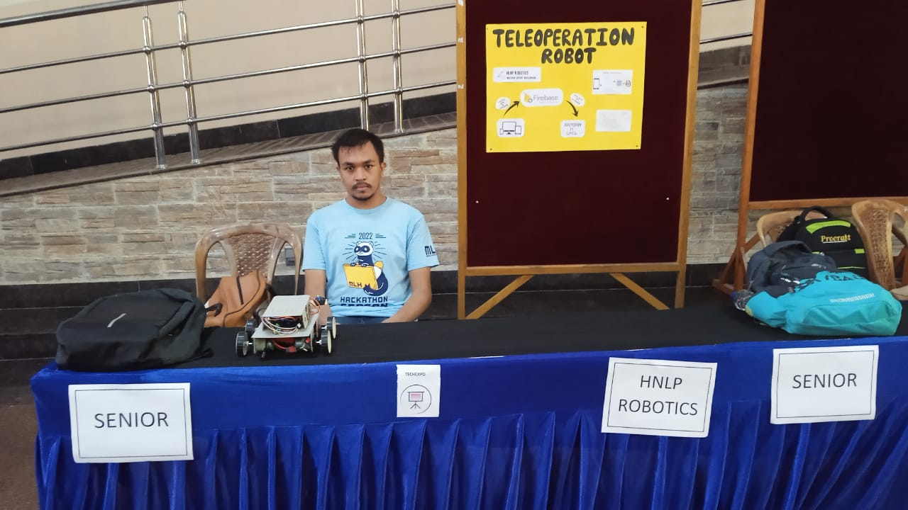

# firebase_teleoperation_robot
# Internet Controlled Teleoperation Robot using Rasberry Pi

## Project presented at - Techniche Tech Expo (https://techniche.org/techexpo) at Indian Institute of Technology, Guwahati

## Software Used
- Python
- PyQt5 -> For GUI
- Firebase Realtime Database
- Rpi.GPIO

## Hardware used 
- Raspberry Pi 4
- Robot Base (Differential drive)
- Servo Motor (For robot Arm)

## Final Project Presentation

 

